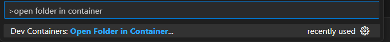
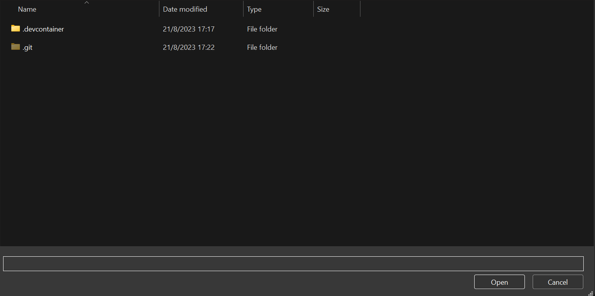
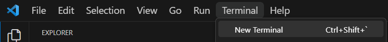
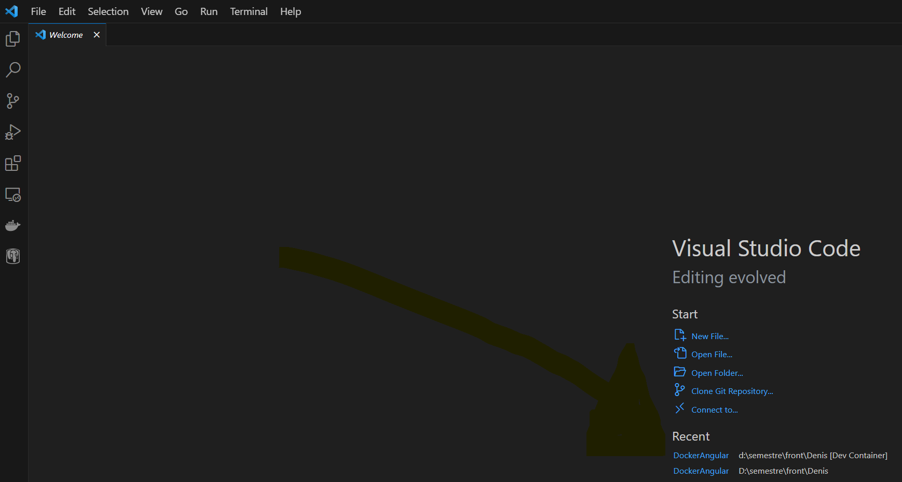

# Requisitos
- (Git)[https://git-scm.com/downloads] 
- Docker instalado y configurado 
	- En caso de tener windows, utilizar el (docker desktop)[https://www.docker.com/products/docker-desktop/]
- Visual Studio code
- Extension de (dev container)[https://marketplace.visualstudio.com/items?itemName=ms-vscode-remote.remote-containers]
# Pasos
- Clonar el repo
```git clone https://github.com/Am-ilcar/DockerAngular.git```
- Iniciar el Docker Desktop, o iniciar el docker daemon en linux
- Abrir Visual Studio Code
	- Abrir el command palette (Ctrl + Shift + P)
		- Seleccionar la opcion "open folder in container"
		
	- Seleccionar el directorio raiz del repositorio clonado, para que detecte las carpetas de configuracion
		
		Abrir en esa misma ubicacion
	- Podria salir un mensaje de que el docker file se modifico, seleccionar la opcion rebuild para que tome estos cambios.
- Luego de que se inicie el docker container se debe abrir una terminal para clonar el repo del proyecto
	
	```git clone https://github.com/fxsosa/tp1front.git```
- Al finalizar, ya tendriamos el entorno listo para el desarrollo
- Este proceso solo se realiza 1 sola vez para construir el container del entorno, para volver a abrirlo se puede seleccionar desde una nueva ventana de visual studio code
	
# Obs:
Los cambios realizados en el proyecto se quedan dentro del container, no asi dentro del la carpeta del docker host