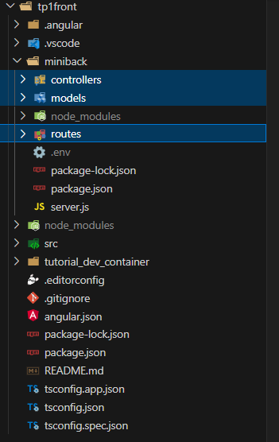
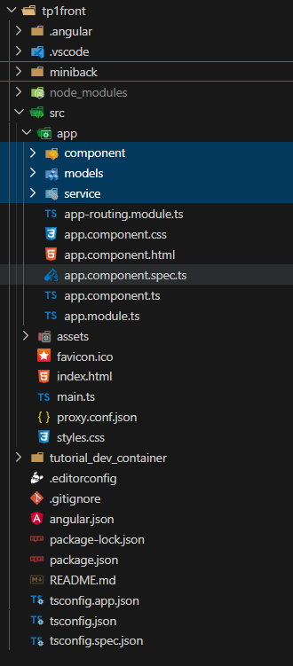
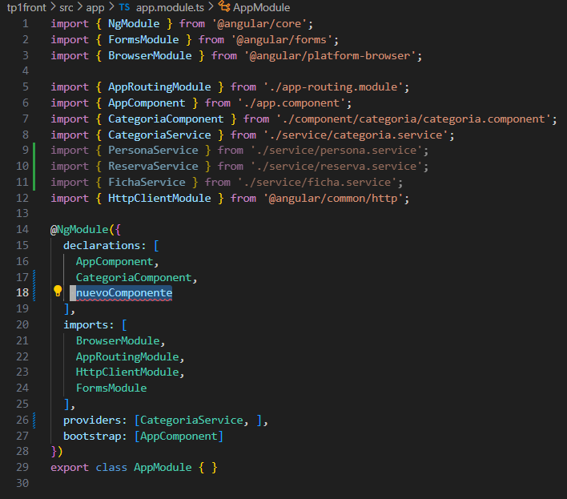

# Partes

## mini back
### Routes
Contiene las rutas para hacer las consultas al back
### models
Contiene los modelos de los datos con los que se va a interactuar 
### Controller
Contiene la logica de los metodos para las routes, si se quiere agregar un metodo nuevo, se debe poner aqui la logica y luego agregar en el routes

## Front
### component
Aqui va cada nuevo componente del proyecto, aqui es donde se pueden hacer las vistas para la pagina y tambien su logica
### models
Aqui va los models con los que se va a interactuar, de manera a estandarizar lo que se manipula
### service
Aqui estan los metodos que van a interactuar con el backend, en teoria ya esta utilizable

## Lo que en teoria queda por hacer:
`ng generate component component/nuevoComponente`
Implementar componentes, editar su html y su .ts para que se pueda ver en pantalla, cada componente debe ser agregado al archivo `app.module.ts` 

